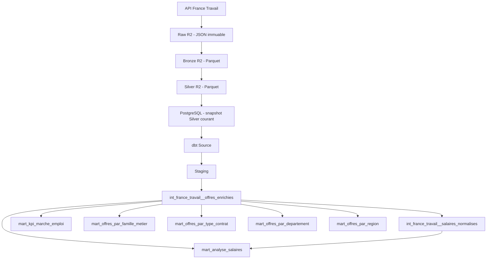

# dbt Processing v2 — Architecture, traçabilité et couche analytique

## 1. Objectif du document

Ce document décrit l’architecture **Processing v2** du projet `job-market-data` pour la chaîne de traitement France Travail, depuis le Data Lake R2 jusqu’aux marts analytiques dbt.

Il formalise :

- le rôle de chaque couche ;
- la distinction entre `batch_id` et `processing_run_id` ;
- la logique de snapshot courant dans PostgreSQL ;
- le rôle de dbt dans la transformation analytique ;
- les règles métier principales ;
- la stratégie de qualité et de tests ;
- les six marts actuellement disponibles ;
- l’état de validation du pipeline avant la phase d’industrialisation.

L’objectif est d’avoir une architecture **rejouable, testable, traçable et explicable en entretien**, sans dupliquer inutilement l’historique entre le Data Lake et PostgreSQL.

---

## 2. Vue d’ensemble de l’architecture



### Principe central

Le projet sépare volontairement deux responsabilités :

- **R2 conserve l’historique immuable et rejouable** ;
- **PostgreSQL expose uniquement le snapshot Silver courant destiné à l’analyse**.

Cette séparation évite de recopier l’historique complet dans PostgreSQL alors que le Data Lake R2 joue déjà ce rôle.

---

## 3. Responsabilité de chaque couche

### 3.1 Source — API France Travail

La source opérationnelle est l’API France Travail.

Une ingestion correspond à un snapshot d’acquisition obtenu à partir d’un ensemble de requêtes de recherche.

Le snapshot actuellement validé contient :

- **889 offres** ;
- **8 requêtes d’acquisition** ;
- un `batch_id` unique ;
- une date d’ingestion unique.

Les requêtes d’acquisition actuellement utilisées sont notamment :

- `data engineer`
- `data analyst`
- `data scientist`
- `business intelligence`
- `bi analyst`
- `analytics engineer`
- `python data`
- `consultant data`

Les mots-clés d’acquisition permettent d’expliquer **comment une offre a été récupérée**. Ils ne doivent pas déterminer automatiquement sa classification métier finale.

---

## 4. Raw R2 — vérité historique immuable

La couche Raw conserve la réponse issue de la source avec un minimum d’altération.

Exemple de convention de chemin :

```text
raw/france_travail/
  ingestion_date=YYYY-MM-DD/
  batch_id=<uuid>/
  offres.json
```

### Responsabilités

La couche Raw sert à :

- conserver la donnée source ;
- permettre le rejeu des traitements ;
- conserver la preuve du snapshot acquis ;
- isoler les transformations ultérieures de la disponibilité de l’API ;
- fournir une base d’audit.

### Principe

Le Raw n’est pas chargé dans PostgreSQL.

Ce choix est volontaire : la structure JSON source est plus adaptée au Data Lake, et PostgreSQL n’a pas besoin de stocker une seconde copie historique du Raw.

---

## 5. Bronze R2 — normalisation structurelle

La couche Bronze transforme le JSON source en structure tabulaire Parquet sans appliquer de logique métier analytique forte.

Convention de chemin :

```text
bronze/france_travail/
  ingestion_date=YYYY-MM-DD/
  batch_id=<uuid>/
  processing_run_id=<uuid>/
  offres.parquet
```

### Responsabilités

La couche Bronze :

- aplatit les structures imbriquées utiles ;
- conserve les champs complexes lorsque nécessaire ;
- homogénéise la structure technique ;
- ajoute les métadonnées de traçabilité ;
- conserve le lien avec le Raw source.

### Métadonnées principales

La couche Bronze transporte notamment :

- `batch_id`
- `processing_run_id` Bronze
- `schema_version`
- objet R2 source
- métadonnées Git lorsque disponibles.

---

## 6. Silver R2 — données métier nettoyées et qualifiées

La couche Silver constitue la version nettoyée, enrichie et standardisée utilisée comme entrée de la couche relationnelle.

Convention de chemin :

```text
silver/france_travail/
  ingestion_date=YYYY-MM-DD/
  batch_id=<uuid>/
  processing_run_id=<uuid>/
  offres.parquet
```

### Responsabilités

La couche Silver :

- renomme et standardise les colonnes ;
- produit des indicateurs de complétude ;
- prépare les champs métier nécessaires à dbt ;
- conserve la traçabilité Raw → Bronze → Silver ;
- constitue le contrat d’entrée vers PostgreSQL.

### Snapshot actuellement validé

Le snapshot v2 validé contient :

```text
889 lignes
70 colonnes
889 id_offre uniques
0 doublon
```

Quelques indicateurs de qualité :

```text
Localisation utilisable       : 100 %
Coordonnées GPS               : 16,76 %
Salaire renseigné             : 28,01 %
Information entreprise        : 73,57 %
```

---

# 7. `batch_id` vs `processing_run_id`

Cette distinction est fondamentale dans Processing v2.

## 7.1 `batch_id`

Le `batch_id` identifie **le snapshot d’acquisition**.

Il répond à la question :

> Quelles données avons-nous récupérées ?

Un même `batch_id` reste identique tant que l’on retravaille exactement le même snapshot source.

Exemple :

```text
batch_id =
ead60f51-e84c-4078-a840-40039a81cc7b
```

Le `batch_id` est donc lié à l’acquisition et non à l’exécution technique d’une transformation.

---

## 7.2 `processing_run_id`

Le `processing_run_id` identifie **une exécution de traitement**.

Il répond à la question :

> Avec quelle exécution de transformation cette version a-t-elle été produite ?

Exemple :

```text
processing_run_id =
d3d7f430-ccae-45e3-a997-6c45913049a0
```

Le même `batch_id` peut théoriquement être retraité plusieurs fois avec :

- une nouvelle version de code ;
- une nouvelle version de schéma ;
- une correction de transformation ;
- une règle métier améliorée.

Dans ce cas :

```text
batch_id identique
processing_run_id différent
```

---

## 7.3 Exemple conceptuel

```text
Acquisition A
batch_id = BATCH-001

Premier traitement
processing_run_id = RUN-001

Correction du code et rejeu du même Raw
processing_run_id = RUN-002
```

Les deux traitements concernent la même acquisition mais pas la même exécution.

Cette séparation apporte :

- auditabilité ;
- reproductibilité ;
- capacité de rejeu ;
- investigation facilitée en cas d’anomalie ;
- meilleure traçabilité entre donnée et code.

---

# 8. PostgreSQL — snapshot analytique courant

## 8.1 Principe

PostgreSQL ne joue pas le rôle d’archive historique du pipeline.

La table :

```text
silver.france_travail_offres
```

représente **le snapshot Silver courant validé**.

L’historique reste conservé dans R2.

---

## 8.2 Pourquoi ne pas historiser tous les batchs dans PostgreSQL ?

Cela évite une duplication de responsabilité :

```text
R2       = historique / replay / stockage immuable
Postgres = exposition relationnelle du snapshot courant
```

Le besoin analytique actuel ne nécessite pas de conserver tous les snapshots dans PostgreSQL.

Si un futur besoin de comparaison temporelle apparaît, une couche historique dédiée pourra être ajoutée explicitement sans modifier le rôle de R2.

---

## 8.3 Chargement Silver → PostgreSQL

Le loader v2 :

1. reçoit explicitement la clé R2 Silver ;
2. vérifie la conformité du chemin ;
3. valide le SHA du fichier ;
4. contrôle le schéma ;
5. contrôle la lignée ;
6. charge les données dans une table temporaire/staging ;
7. remplace atomiquement le snapshot actif ;
8. écrit un audit de chargement ;
9. évite un rechargement inutile lorsque le snapshot exact est déjà présent.

### Propriétés recherchées

Le chargement est conçu pour être :

- **idempotent** ;
- **observable** ;
- **rejouable** ;
- **atomique**.

La clé primaire métier reste :

```text
id_offre
```

Le snapshot actuellement chargé contient :

```text
889 lignes
889 id_offre distincts
1 batch_id
1 processing_run_id
```

---

# 9. Rôle de dbt

dbt intervient **après le chargement Silver dans PostgreSQL**.

Il ne remplace pas :

- l’ingestion API ;
- le stockage Raw ;
- la transformation structurelle Bronze ;
- la production Silver ;
- le chargement R2 → PostgreSQL.

dbt prend en charge la couche **transformation analytique relationnelle**.

Chaîne logique :

```text
PostgreSQL Silver
    ↓
dbt source
    ↓
staging
    ↓
intermediate
    ↓
marts
```

---

# 10. Source dbt

La source dbt pointe vers :

```text
silver.france_travail_offres
```

Elle représente le contrat entre le pipeline Python/R2/PostgreSQL et dbt.

Les tests source contrôlent notamment :

- unicité de `id_offre` ;
- absence de `id_offre` null ;
- présence des champs métier indispensables ;
- présence des identifiants de lignée ;
- présence des versions de schéma ;
- présence de la clé de l’objet Silver chargé.

Le snapshot actuel a passé :

```text
13 / 13 tests source
```

---

# 11. Staging dbt

Modèle :

```text
stg_france_travail__offres
```

### Responsabilité

Le staging fournit une interface propre entre la table physique PostgreSQL et les transformations métier.

Il :

- sélectionne les colonnes nécessaires ;
- stabilise les noms ;
- expose les métadonnées de lignée ;
- ne porte pas de logique analytique complexe.

La traçabilité propagée comprend notamment :

```text
batch_id
processing_run_id
silver_schema_version
bronze_processing_run_id
bronze_schema_version
objet_source_raw
objet_source_bronze
fichier_source_silver
```

Le staging conserve également :

```text
mot_cle_recherche
mots_cles_recherche
```

Ces colonnes décrivent l’acquisition.

---

# 12. Intermediate principal

Modèle :

```text
int_france_travail__offres_enrichies
```

Ce modèle constitue le principal niveau métier avant les marts.

Il contient actuellement **889 offres**.

## 12.1 Responsabilités

Il enrichit les offres avec :

- informations temporelles ;
- classification métier ;
- normalisation géographique ;
- catégories de contrat ;
- expérience ;
- temps de travail ;
- qualité de l’offre ;
- présence de technologies Cloud / DevOps ;
- indicateurs de tension ;
- indicateurs salariaux ;
- lignée technique.

---

# 13. Classification des familles métier

Les familles actuellement utilisées sont :

```text
Data Engineering
Data Analysis / BI
Data Science / IA
Autre data / numérique
```

Distribution du snapshot validé :

```text
Data Engineering        510   57,37 %
Data Analysis / BI      255   28,68 %
Data Science / IA        97   10,91 %
Autre data / numérique   27    3,04 %
```

## 13.1 Principe important : pas de target leakage

Les mots-clés d’acquisition :

```text
data engineer
data scientist
python data
...
```

ne sont **pas utilisés pour forcer la famille métier**.

La classification repose sur le contenu métier de l’offre :

- intitulé ;
- description ;
- libellé ROME ;
- appellation.

Ainsi, une offre trouvée par la requête `data scientist` peut être classée Data Engineering si son contenu correspond réellement davantage à cette famille.

Cela évite de confondre :

```text
méthode d’acquisition
```

avec :

```text
classification métier
```

---

# 14. Géographie

La géographie a fait l’objet d’une normalisation métier spécifique.

## 14.1 Deux notions distinctes

### Coordonnées GPS renseignées

```text
coordonnees_renseignees =
latitude IS NOT NULL
AND longitude IS NOT NULL
```

### Localisation utilisable

```text
localisation_renseignee =
libellé lieu
OR commune
OR code postal
OR coordonnées GPS
```

Le score de qualité utilise la **localisation utilisable**, et non uniquement la présence de GPS.

---

## 14.2 Construction du département

Le modèle ne transforme pas automatiquement tout préfixe postal en département.

Sont reconnus explicitement :

- départements métropolitains ;
- Corse ;
- DROM actuellement concernés :
  - 971
  - 972
  - 973
  - 974
  - 976

Les territoires qui ne constituent pas un département ne sont pas artificiellement injectés dans le référentiel départemental.

### Exemple : Nouvelle-Calédonie

```text
988 - Nouméa
```

Le code `988` n’est pas traité comme un département français.

Il donne donc :

```text
code_departement = NULL
```

### Exemple : valeur nationale

```text
France
code_postal = 99999
```

Cette valeur ne doit pas produire artificiellement :

```text
code_departement = 99
```

Elle est également traitée comme non départementale.

---

## 14.3 Référentiel

Le seed :

```text
referentiel_departements
```

sert à enrichir les départements valides avec leurs informations de référence, notamment la région.

Le test :

```text
assert_departements_match_referentiel
```

garantit que les codes département présents dans le modèle sont compatibles avec le référentiel.

---

# 15. Intermediate salaires

Modèle :

```text
int_france_travail__salaires_normalises
```

Il contient uniquement les offres avec un salaire renseigné.

Snapshot actuel :

```text
249 offres avec salaire renseigné
```

---

## 15.1 Parsing

Les formats structurés pris en charge comprennent :

```text
Annuel de X Euros
Annuel de X Euros à Y Euros
Mensuel de X Euros
Mensuel de X Euros à Y Euros
Horaire de X Euros
Horaire de X Euros à Y Euros
```

avec éventuellement :

```text
sur Z mois
```

et un commentaire libre après :

```text
 - commentaire
```

Exemple :

```text
Annuel de 40000.0 Euros à 45000.0 Euros - Selon profil
```

Le commentaire est conservé dans `salaire_libelle`, mais n’est pas utilisé automatiquement pour modifier les montants.

---

## 15.2 Annualisation

### Salaire annuel

Conservé tel quel.

### Salaire mensuel

Annualisé par :

```text
salaire mensuel × 12
```

### Salaire horaire

Non annualisé.

Ce choix est volontaire : annualiser un salaire horaire nécessiterait une hypothèse supplémentaire sur le volume annuel d’heures travaillées.

Le modèle préfère donc éviter une transformation implicite non garantie par la source.

---

## 15.3 Valeurs atypiques

Le modèle utilise actuellement un seuil de contrôle :

```text
200 000 EUR / an
```

Une valeur supérieure n’est pas supprimée ni corrigée automatiquement.

Elle est marquée :

```text
salaire_suspect = true
```

et exclue des KPI nécessitant un salaire fiable.

Le principe est :

> détecter l’anomalie, la conserver, la signaler, mais ne pas inventer une correction.

---

## 15.4 Exploitabilité

Un salaire est considéré exploitable lorsque notamment :

- le parsing a réussi ;
- la période est cohérente ;
- il n’est pas horaire ;
- il n’est pas suspect ;
- les bornes annualisées sont présentes ;
- le minimum est positif ;
- le maximum est supérieur ou égal au minimum.

Le motif d’exclusion reste disponible lorsque le salaire ne peut pas être utilisé dans les KPI.

---

# 16. Les six marts analytiques

## 16.1 `mart_kpi_marche_emploi`

Mart de synthèse globale.

Il contient une ligne avec les KPI principaux du snapshot.

Snapshot actuel :

```text
Nombre total d’offres                  889
Data Engineering                       510
Part Data Engineering                57,37 %
Départements couverts                   61
Transparence salariale               28,01 %
Offres avec coordonnées GPS          16,76 %
Information entreprise disponible    73,57 %
Score moyen de qualité                 7,02
```

---

## 16.2 `mart_offres_par_famille_metier`

Analyse les offres par famille Data.

Dimensions principales :

```text
Data Engineering
Data Analysis / BI
Data Science / IA
Autre data / numérique
```

Le mart contient actuellement :

```text
4 lignes
```

Il expose notamment :

- nombre d’offres ;
- part de marché ;
- part CDI ;
- transparence salariale ;
- couverture géographique ;
- Cloud / DevOps ;
- difficulté de recrutement ;
- qualité moyenne.

---

## 16.3 `mart_offres_par_type_contrat`

Analyse la répartition par catégorie de contrat.

Distribution actuelle :

```text
CDI                       530   59,62 %
Indépendant / franchise   202   22,72 %
CDD / mission             115   12,94 %
Alternance                 41    4,61 %
Autre                       1    0,11 %
```

Le total correspond aux :

```text
889 offres
```

---

## 16.4 `mart_offres_par_departement`

Analyse territoriale au niveau départemental.

Le mart actuel contient :

```text
62 lignes
```

Il s’appuie sur le référentiel des départements et exclut des codes département artificiels les territoires ou valeurs qui ne représentent pas réellement un département.

Il fournit notamment :

- volume d’offres ;
- part nationale ;
- familles métier ;
- CDI ;
- alternance ;
- salaire ;
- Cloud / DevOps ;
- offres récentes ;
- qualité.

---

## 16.5 `mart_offres_par_region`

Analyse territoriale au niveau régional.

Le mart actuel contient :

```text
17 lignes
```

Exemples de distribution :

```text
Île-de-France                506   56,92 %
Auvergne-Rhône-Alpes          78    8,77 %
Occitanie                     47    5,29 %
Provence-Alpes-Côte d'Azur    41    4,61 %
Hauts-de-France               38    4,27 %
```

Une catégorie :

```text
Non renseigné
```

est conservée lorsque l’offre ne peut pas être rattachée proprement à un département/région.

---

## 16.6 `mart_analyse_salaires`

Mart dédié à l’analyse salariale.

Il rapproche les offres du modèle principal avec les salaires normalisés.

Il permet notamment d’analyser :

- nombre de salaires renseignés ;
- nombre de salaires exploitables ;
- nombre de salaires non exploitables ;
- valeurs suspectes ;
- transparence salariale ;
- indicateurs salariaux par axes analytiques.

Le mart contient actuellement :

```text
27 lignes
```

---

# 17. Stratégie de tests dbt

Le projet utilise plusieurs niveaux de tests.

## 17.1 Tests génériques

Exemples :

```text
not_null
unique
accepted_values
```

Ils garantissent les invariants structurels des modèles.

---

## 17.2 Tests métier singuliers

Les tests singuliers contrôlent des règles inter-modèles ou métier.

Exemples :

```text
assert_departements_match_referentiel
assert_mart_salaires_global_matches_sources
assert_mart_famille_metier_volume_matches_global
assert_mart_departement_volume_matches_global
assert_mart_region_volume_matches_global
assert_mart_departement_parts_sum_100
assert_mart_region_parts_sum_100
assert_salaires_tous_parses
assert_salaires_periodes_coherentes
assert_salaires_exploitables_coherents
assert_salaires_suspects_non_exploitables
```

---

## 17.3 Réconciliation

Les marts ne sont pas testés uniquement colonne par colonne.

Des tests vérifient également que leurs agrégats se réconcilient avec les modèles sources.

Exemple :

```text
SUM(nombre_offres des familles métier)
=
nombre_total_offres du KPI global
```

Cette approche détecte les erreurs de jointure, de filtre ou de granularité qui pourraient passer inaperçues avec de simples tests `not_null`.

---

# 18. État de validation actuel

Après la migration Processing v2 :

```text
dbt test

PASS  = 207
WARN  = 0
ERROR = 0
SKIP  = 0
TOTAL = 207
```

Le projet dbt est donc entièrement vert sur le snapshot actuel.

État synthétique :

```text
Source PostgreSQL                         VALIDÉ
Staging                                   VALIDÉ
int_france_travail__offres_enrichies      VALIDÉ
int_france_travail__salaires_normalises   VALIDÉ

mart_kpi_marche_emploi                    VALIDÉ
mart_offres_par_famille_metier            VALIDÉ
mart_offres_par_type_contrat              VALIDÉ
mart_offres_par_departement               VALIDÉ
mart_offres_par_region                    VALIDÉ
mart_analyse_salaires                     VALIDÉ

Tests dbt                                207 / 207
```

---

# 19. Suppression du concept de “latest batch” dans dbt

Un ancien test :

```text
assert_int_offres_enrichies_latest_batch.sql
```

a été supprimé.

Cette suppression est volontaire.

Dans la nouvelle architecture :

```text
PostgreSQL = snapshot Silver courant
```

dbt ne reçoit donc déjà qu’un seul snapshot actif.

La sélection du “dernier batch” à l’intérieur des modèles dbt serait redondante et créerait une responsabilité ambiguë.

La responsabilité de choisir et charger le snapshot courant appartient désormais au processus :

```text
R2 Silver → PostgreSQL
```

et non aux modèles analytiques.

---

# 20. Traçabilité de bout en bout

La chaîne doit permettre de répondre aux questions suivantes :

### Quelle acquisition a produit cette donnée ?

```text
batch_id
```

### Quelle exécution a produit cette version Silver ?

```text
processing_run_id
```

### Quelle version du schéma a été utilisée ?

```text
silver_schema_version
bronze_schema_version
```

### De quel fichier vient la donnée ?

```text
objet_source_raw
objet_source_bronze
fichier_source_silver
```

### Quel code a produit la transformation ?

La provenance Git est enregistrée dans les étapes Python et les commits du projet permettent d’identifier la version des modèles dbt utilisée.

Commit dbt Processing v2 :

```text
29193fb
feat(dbt): migrate models to processing v2 lineage
```

---

# 21. Principes d’architecture retenus

Le pipeline respecte actuellement les principes suivants.

## Idempotence

Rejouer un chargement déjà effectué ne doit pas créer de doublons ni modifier arbitrairement l’état.

## Immutabilité du Data Lake

Les snapshots R2 sont conservés comme références historiques.

## Snapshot relationnel courant

PostgreSQL expose la version analytique active sans dupliquer l’historique complet.

## Séparation acquisition / métier

Les mots-clés utilisés pour récupérer les offres ne déterminent pas automatiquement leur famille métier.

## Pas de correction silencieuse

Une anomalie de salaire est signalée plutôt que modifiée arbitrairement.

## Tests de réconciliation

Les agrégats des marts doivent correspondre aux modèles amont.

## Traçabilité explicite

Les identifiants d’acquisition et de traitement sont distincts et propagés dans les couches.

---

# 22. Frontière actuelle avant industrialisation

À ce stade, la logique fonctionnelle et analytique du pipeline est considérée comme stabilisée.

La prochaine phase ne doit pas redéfinir les règles métier sans nécessité.

Elle doit principalement industrialiser l’exécution.

Architecture cible :

```text
Airflow
  |
  +-- ingestion France Travail
  |
  +-- Raw R2
  |
  +-- Raw → Bronze
  |
  +-- Quality Gate Bronze
  |
  +-- Bronze → Silver
  |
  +-- Quality Gate Silver
  |
  +-- chargement snapshot PostgreSQL
  |
  +-- validation R2 ↔ PostgreSQL
  |
  +-- dbt run
  |
  +-- dbt test
  |
  +-- publication / consommation BI
```

Les prochains sujets d’industrialisation pourront inclure :

- orchestration Airflow ;
- conteneurisation Docker des composants ;
- gestion des dépendances entre tâches ;
- retries ;
- timeouts ;
- observabilité ;
- logs centralisés ;
- alerting ;
- gestion des secrets ;
- CI/CD GitHub ;
- exécution dbt contrôlée ;
- documentation dbt générée ;
- stratégie de déploiement ;
- exposition BI.

---

# 23. Résumé architectural

Le pipeline Processing v2 peut être résumé ainsi :

```text
API France Travail
        ↓
Raw R2 immuable
        ↓
Bronze R2
        ↓
Silver R2
        ↓
Snapshot Silver courant PostgreSQL
        ↓
dbt source
        ↓
staging
        ↓
intermediate
        ↓
marts
        ↓
Power BI / analyses
```

Avec la responsabilité suivante :

```text
R2
= historique + replay + preuve du traitement

PostgreSQL
= snapshot analytique courant

dbt
= transformation métier relationnelle + tests + marts

Airflow (prochaine phase)
= orchestration du pipeline complet
```

---

## 24. Statut

**Processing v2 — dbt : VALIDÉ**

```text
Snapshot : 889 offres
Tests dbt : 207 / 207 PASS
Warnings : 0
Errors   : 0
```

Cette version constitue le point de référence fonctionnel avant la phase d’industrialisation.
